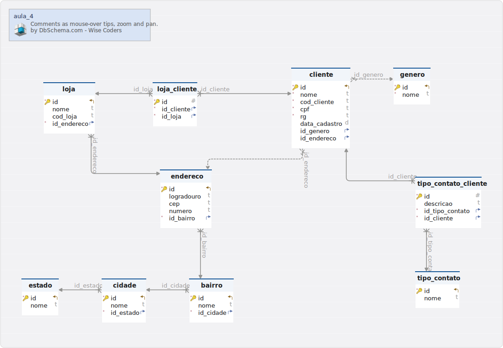

#aula_4
Generated using [DbSchema](https://dbschema.com)

### aula_4

### Table public.bairro 
|Idx |Name |Data Type |
|---|---|---|
| * &#128273;  &#11019; | id| INTEGER UNSIGNED  |
|  | nome| VARCHAR(100)  |
| * &#11016; | id\_cidade| INTEGER UNSIGNED  |

##### Indexes 
|Type |Name |On |
|---|---|---|
| &#128273;  | pk\_bairro | ON id|

##### Foreign Keys
|Type |Name |On |
|---|---|---|
|  | fk_bairro_cidade | ( id\_cidade ) ref [public.cidade](#cidade) (id) |

### Table public.cidade 
|Idx |Name |Data Type |
|---|---|---|
| * &#128273;  &#11019; | id| INTEGER UNSIGNED  |
|  | nome| VARCHAR(100)  |
| * &#11016; | id\_estado| INTEGER UNSIGNED  |

##### Indexes 
|Type |Name |On |
|---|---|---|
| &#128273;  | pk\_cidade | ON id|

##### Foreign Keys
|Type |Name |On |
|---|---|---|
|  | fk_cidade_estado | ( id\_estado ) ref [public.estado](#estado) (id) |

### Table public.cliente 
|Idx |Name |Data Type |
|---|---|---|
| * &#128273;  &#11019; | id| INTEGER UNSIGNED  |
| * | nome| VARCHAR(100)  |
| * | cod\_cliente| VARCHAR(20)  |
| * | cpf| VARCHAR(20)  |
| * | rg| VARCHAR(20)  |
|  | data\_cadastro| DATE  |
| &#11016; | id\_genero| INTEGER UNSIGNED  |
| &#11016; | id\_endereco| INTEGER UNSIGNED  |

##### Indexes 
|Type |Name |On |
|---|---|---|
| &#128273;  | pk\_cliente\_0 | ON id|

##### Foreign Keys
|Type |Name |On |
|---|---|---|
|  | fk_cliente_genero | ( id\_genero ) ref [public.genero](#genero) (id) |
|  | fk_cliente_endereco | ( id\_endereco ) ref [public.endereco](#endereco) (id) |

### Table public.endereco 
|Idx |Name |Data Type |
|---|---|---|
| * &#128273;  &#11019; | id| INTEGER UNSIGNED  |
|  | logradouro| VARCHAR(200)  |
|  | cep| VARCHAR(20)  |
|  | numero| VARCHAR(20)  |
| * &#11016; | id\_bairro| INTEGER UNSIGNED  |

##### Indexes 
|Type |Name |On |
|---|---|---|
| &#128273;  | pk\_endereco | ON id|

##### Foreign Keys
|Type |Name |On |
|---|---|---|
|  | fk_endereco_bairro | ( id\_bairro ) ref [public.bairro](#bairro) (id) |

### Table public.estado 
|Idx |Name |Data Type |
|---|---|---|
| * &#128273;  &#11019; | id| INTEGER UNSIGNED  |
|  | nome| VARCHAR(100)  |

##### Indexes 
|Type |Name |On |
|---|---|---|
| &#128273;  | pk\_estado | ON id|

### Table public.genero 
|Idx |Name |Data Type |
|---|---|---|
| * &#128273;  &#11019; | id| INTEGER UNSIGNED  |
| * | nome| VARCHAR(100)  |

##### Indexes 
|Type |Name |On |
|---|---|---|
| &#128273;  | pk\_genero | ON id|

### Table public.loja 
|Idx |Name |Data Type |
|---|---|---|
| * &#128273;  &#11019; | id| INTEGER UNSIGNED  |
|  | nome| VARCHAR(100)  |
|  | cod\_loja| VARCHAR(20)  |
| * &#11016; | id\_endereco| INTEGER UNSIGNED  |

##### Indexes 
|Type |Name |On |
|---|---|---|
| &#128273;  | pk\_loja | ON id|

##### Foreign Keys
|Type |Name |On |
|---|---|---|
|  | fk_loja_endereco | ( id\_endereco ) ref [public.endereco](#endereco) (id) |

### Table public.loja_cliente 
|Idx |Name |Data Type |
|---|---|---|
| * &#128273;  | id| INTEGER UNSIGNED  |
| * &#11016; | id\_cliente| INTEGER UNSIGNED  |
| * &#11016; | id\_loja| INTEGER UNSIGNED  |

##### Indexes 
|Type |Name |On |
|---|---|---|
| &#128273;  | pk\_loja\_cliente | ON id|

##### Foreign Keys
|Type |Name |On |
|---|---|---|
|  | fk_loja_cliente_cliente | ( id\_cliente ) ref [public.cliente](#cliente) (id) |
|  | fk_loja_cliente_loja | ( id\_loja ) ref [public.loja](#loja) (id) |

### Table public.tipo_contato 
|Idx |Name |Data Type |
|---|---|---|
| * &#128273;  &#11019; | id| INTEGER UNSIGNED  |
|  | nome| VARCHAR(100)  |

##### Indexes 
|Type |Name |On |
|---|---|---|
| &#128273;  | pk\_tipo\_contato | ON id|

### Table public.tipo_contato_cliente 
|Idx |Name |Data Type |
|---|---|---|
| * &#128273;  | id| INTEGER UNSIGNED  |
|  | descricao| VARCHAR(400)  |
| * &#11016; | id\_tipo\_contato| INTEGER UNSIGNED  |
| * &#11016; | id\_cliente| INTEGER UNSIGNED  |

##### Indexes 
|Type |Name |On |
|---|---|---|
| &#128273;  | pk\_tipo\_contato\_cliente | ON id|

##### Foreign Keys
|Type |Name |On |
|---|---|---|
|  | fk_tipo_contato_cliente_cliente | ( id\_cliente ) ref [public.cliente](#cliente) (id) |
|  | fk_tipo_contato_cliente_tipo_contato | ( id\_tipo\_contato ) ref [public.tipo\_contato](#tipo\_contato) (id) |

